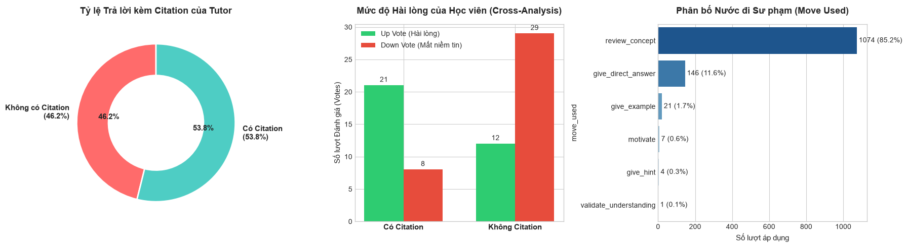

<div align="center">
  <h1>🎓 VLearn AI Tutor</h1>
  <p><em>Người Trợ giảng AI Thông minh - Khai phóng Sức mạnh Tự học của Học viên</em></p>
  <p><b>Cohort 4 - claudeMAX</b></p>
</div>

---

## 🌟 Giới thiệu Dự án

Khi học sinh học qua video bài giảng và slide, một trong những nỗi đau (Pain Point) lớn nhất là việc **bị đứt mạch học** khi gặp những thuật ngữ khó hiểu. Việc phải dừng video, mở tab mới, lên Google tìm kiếm không chỉ gây mất tập trung mà còn khiến học sinh tiếp thu những luồng kiến thức không đồng nhất với triết lý của khóa học.



**VLearn AI Tutor** ra đời để giải quyết vấn đề đó. Đây là một chatbot AI được nhúng trực tiếp vào trải nghiệm học tập, có khả năng "đọc" được đúng trang slide mà học sinh đang xem để giải đáp thắc mắc ngay lập tức, chính xác, và bám sát nội dung khóa học.

---

## 🚀 Tính năng Cốt lõi (Core Features)

1. **Dual-mode RAG (RAG Bám rễ & RAG Mở rộng):**
   - *Anchored RAG:* Rút trích chính xác nội dung của trang slide hiện tại khi học sinh bôi đen từ khoá.
   - *Unanchored RAG:* Chạy thuật toán tìm kiếm Vector (Qdrant) trên Transcript và Token-overlap trên toàn bộ Slide nếu học viên hỏi tự do.
2. **Scope Classifier (Lá chắn lạc đề):** Ngăn chặn triệt để các câu hỏi không liên quan (thời tiết, nấu ăn, giải trí) và các mưu đồ Jailbreak, giúp tiết kiệm chi phí API.
3. **Google Search Grounding:** Tự động kết nối với Google Search khi slide không đủ kiến thức. Hỗ trợ hiển thị UI dạng **Hover Card (External Links)** hiện đại để đọc thêm bài báo ngoài (Wikipedia, Coursera) mà không che khuất màn hình.
4. **Follow-up Suggestions:** Trả về các câu hỏi gợi mở dạng "Chips" để kích thích tư duy người học đi sâu hơn.
5. **Knowledge Graph Pipeline (Chuẩn bị cho Phase 2):** Backend tích hợp sẵn Background Task mô phỏng quá trình thu thập log thành các Graph Edges (Nodes & Links) chuẩn bị cho việc xây dựng Đồ thị tri thức đánh giá năng lực học sinh.

---

## 💻 Công nghệ Sử dụng (Tech Stack)

- **AI & LLM:** Google Gemini 2.5 Flash, Gemini API Search Grounding.
- **Backend:** Python, FastAPI, Qdrant (Vector Database), Uvicorn.
- **Frontend:** React, Vite, Tailwind CSS, React-Markdown.

---

## 👥 Danh sách Thành viên & Phân công

Dự án được xây dựng bởi 4 thành viên thuộc Nhóm 01:

| Họ và tên | Mã Học Viên | Phân công Công việc |
| :--- | :--- | :--- |
| **Nguyễn Đại Quân** | 2A202601933 | **Backend:** Xây dựng luồng RAG chính, tích hợp Qdrant Vector DB, kết nối Gemini API, và xây dựng mô phỏng Knowledge Graph. |
| **Trần Kiên** | 2A202601598 | **Frontend:** Xây dựng giao diện Chat (React/Vite), hiển thị trích dẫn (Citations)|
| **Nguyễn Phú Quang** | 2A202602017 | **Prompt Engineering:** Viết System Prompt, thiết kế Scope Classifier để lọc câu hỏi lạc đề/jailbreak, và tối ưu file `spec.md`. |
| **Trần Tuấn Linh** | 2A2026001612 | **Eval & Validation:** Gom dữ liệu, tạo Golden Set đánh giá (Evidence), đo lường Quality Bar, và chuẩn bị Demo Slides. |

## 📂 Cấu trúc Repository (Nộp bài)

```text
qn1304/
├── README.md               ← File giới thiệu & Phân công (Bạn đang đọc).
├── specs.md                ← AI Spec chi tiết chuẩn Hackathon.
├── knowledge_graph_mock.jsonl ← Log giả lập Đồ thị tri thức (Showcase).
├── codebase/
│   ├── backend/            ← Source code Python FastAPI, llm_caller.
│   └── frontend/           ← Source code React Vite UI.
├── data/                   ← Dataset (Đã ẩn danh) dùng cho RAG.
└── eval/                   ← [Cập nhật sau] Chứa Golden set & Quality Bar.
```

---

## ⚙️ Hướng dẫn Cài đặt & Khởi chạy

**1. Khởi chạy Backend:**
```bash
cd codebase
uv run python backend/main.py
```
*(Server chạy tại: `http://127.0.0.1:8000`)*

**2. Khởi chạy Frontend:**
```bash
cd codebase/frontend
npm install
npm run dev
```
*(Truy cập UI tại đường dẫn Localhost cung cấp trên Terminal)*
